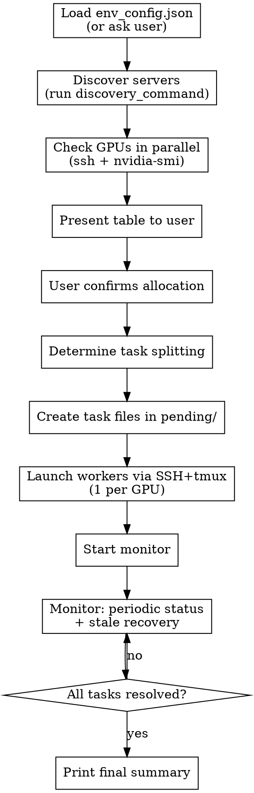

# GPU Distributor

## Overview

Distribute GPU tasks across multiple servers using a filesystem-based task queue. Workers on each server pull tasks from a shared queue, execute them, and report results. A monitor handles status reporting and stale task recovery.

**Orchestrator scripts:** `~/projects/claude_scratch/_shared/gpu-orchestrator/`

## Configuration

On first use per environment, read the config file at `~/projects/claude_scratch/_shared/gpu-orchestrator/env_config.json`. If it doesn't exist, ask the user:
1. How to discover available servers (e.g., `tsh ls`, `sinfo`, `cat /etc/hosts`, etc.)
2. What server name pattern to filter for (e.g., `gpu*`, `node*`)
3. How to SSH into them (e.g., `ssh hostname`, `ssh user@hostname`)

Save their answers to `env_config.json` so future sessions don't need to ask again.

```json
{
  "discovery_command": "tsh ls | grep qrnd",
  "server_pattern": "qrnd*",
  "ssh_command": "ssh {server}",
  "notes": "Servers are internally allocated — always ask user which are available"
}
```

## Workflow



## Step 1: Server Discovery

Run the `discovery_command` from `env_config.json`, then check GPUs on all discovered servers in parallel:
```bash
ssh {server} nvidia-smi --query-gpu=index,name,memory.total,memory.used,memory.free,utilization.gpu --format=csv,noheader,nounits
```

Present a table:
```
Server   | GPUs | Model  | VRAM Free    | GPU Util
---------|------|--------|--------------|--------
srv01    | 4    | L40    | 48/48 GB ea  | 0%
srv02    | 8    | H100   | 72/80 GB ea  | 5%
```

**Always ask the user** which servers are allocated to their team. Cache for the session.

## Step 2: Task Splitting

Based on context, either:
- **Discrete commands:** User provides N commands → N task files
- **Dataset split:** User provides one script + dataset → Claude splits data into chunks, creates one task per chunk

Factor in GPU capability when splitting — assign more work to servers with more/faster GPUs.

## Step 3: Launch

```bash
python ~/projects/claude_scratch/_shared/gpu-orchestrator/orchestrator.py \
  --job-dir ~/projects/claude_scratch/{project}/{date}/{job-name} \
  --servers '{"srv01": {"gpus": [{"id": 0, "vram_mb": 49152}, ...]}, ...}' \
  --tasks tasks.json
```

This creates the queue, deploys workers via SSH+tmux, and starts the monitor.

## Step 4: Monitoring

Monitor runs locally, prints periodic status:
```
[14:05:30] pending: 12 | running: 8 | completed: 45 | failed: 1
```

Auto-recovers stale tasks (worker died, heartbeat >5min old).
Prints immediate warning on deterministic failures.

## Error Handling

- **Deterministic errors** (missing files, import errors, syntax errors): no retry, move to `failed/`
- **Transient errors** (SSH drop, OOM kill, GPU errors): retry up to 3 times with priority bump
- **Resource mismatch** (OOM on small GPU): re-queue with `gpu_vram_required_gb` tag
- Use judgment on error classification — the patterns above are guidance, not a fixed lookup

## Queue Structure

```
{job-dir}/
  queue/
    pending/      # task_001.json, task_002.json, ...
    running/      # picked up by workers (+ .heartbeat files)
    completed/    # success
    failed/       # exhausted retries or deterministic error
  logs/           # {worker_id}_{task_id}.log
  monitor.log
  config.json
```

## Key Details

- All tasks start with equal priority. Failed-retried tasks get bumped.
- Workers use `filelock` to ensure only one picks up each task.
- Workers run in `tmux` sessions to survive SSH disconnects.
- `_shared/gpu-orchestrator/` is persistent — never auto-cleaned.
- `filelock` must be installed on all servers. Verify during setup.
