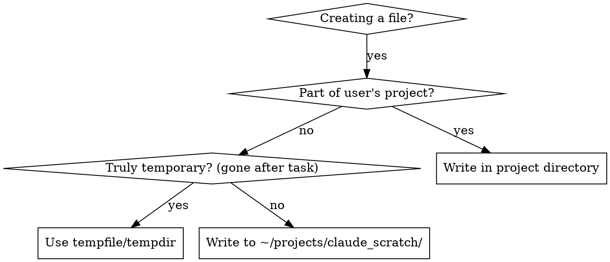

# Scratch Directory

## Overview

All files Claude creates for its own use (not part of the user's project) go in `~/projects/claude_scratch/`. This keeps Claude's working artifacts separate from the user's codebase.

## Decision: Where Does This File Go?



## Directory Hierarchy

Organize files so they're findable across sessions:

```
~/projects/claude_scratch/
  {project-name}/              # Match the project being worked on
    {date-YYYY-MM-DD}/         # Date of creation
      {descriptive-name}/      # What the files are for
        file1.py
        file2.txt
  _shared/                     # Cross-project utilities
    {descriptive-name}/
      tool.sh
```

**Example:**
```
~/projects/claude_scratch/
  my-web-app/
    2026-04-01/
      api-load-test/
        test_script.py
        results.json
      schema-migration-draft/
        migration.sql
  _shared/
    json-formatter/
      format.py
```

## Rules

1. **Always use the hierarchy** - never dump files directly into `claude_scratch/`
2. **Descriptive names** - future sessions should understand what a directory contains at a glance
3. **Use `tempfile`/`tempdir` for throwaway work** - if the file won't be needed after the current task step, use the system temp directory
4. **Clean up when done** - delete files/directories in `claude_scratch/` once the task they support is complete
5. **Prune stale files** - if you notice directories older than 7 days during any session, delete them unless they contain files that are clearly still relevant (e.g., referenced in recent conversation or actively used)
6. **Never store secrets** - no API keys, credentials, or tokens in scratch files

## What Goes Where

| File type | Location |
|-----------|----------|
| User's source code, configs, tests | Project directory |
| Throwaway intermediate output | `tempfile`/`tempdir` |
| Analysis scripts Claude wrote | `~/projects/claude_scratch/{project}/{date}/{desc}/` |
| Generated test data | `~/projects/claude_scratch/{project}/{date}/{desc}/` |
| Draft migrations, schemas | `~/projects/claude_scratch/{project}/{date}/{desc}/` |
| Comparison benchmarks | `~/projects/claude_scratch/{project}/{date}/{desc}/` |
| Cross-project utilities | `~/projects/claude_scratch/_shared/{desc}/` |

## Cleanup Protocol

At session start, if working in `claude_scratch/`:
- List directories older than 7 days
- Delete any that aren't actively referenced
- **Never delete `_shared/`** — this contains persistent cross-project tools (e.g., gpu-orchestrator) that must survive across sessions indefinitely
- Report what was cleaned to the user only if asked
