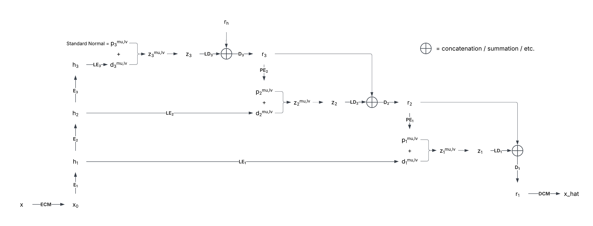
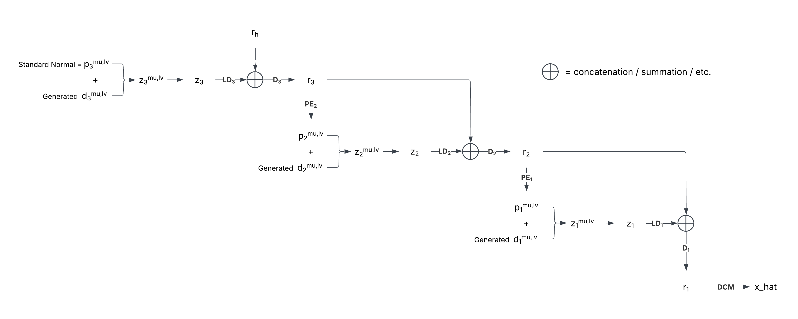

Terminology:
- $x$: input
- $E_i$: encoder block at $i$ th level
- $h_i$: output of encoder block at $i$ th level
- $LE_i$: latent encoders at $i$ th level. These reduce the dimensions to desired number of channels and estimate mu and logvar.
- $d^{mu,lv}_i$: deviation from prior distribution at $i$ th level. $m$ stands for mu, $lv$ stands for logvar. Estimated by $LE_i$.
- $PE_i$: prior estimators at $i$ th level
- $p^{mu,lv}_i$: prior distribution at $i$ th level. Estimated by $PE_i$
- $z^{mu,lv}_i$: posterior distribution at $i$ th level
- $LD_i$: latent decoders at $i$ th level. These expand the channels back to the hidden dimension.
- $D_i$: decoder block at $i$ th level
- $r_i$: output of decoder block at $i$ th level
- $r_h$: learnable tensor that is added to the deepest latent decoding (see in diagram)
- $ECM$, $DCM$: encoder and decoder channel mappers

---

Here is how the NVAE training process for a depth of 3 looks like:

For sampling:

Or you can sample the posteriors directly with conditioning on the prior.
